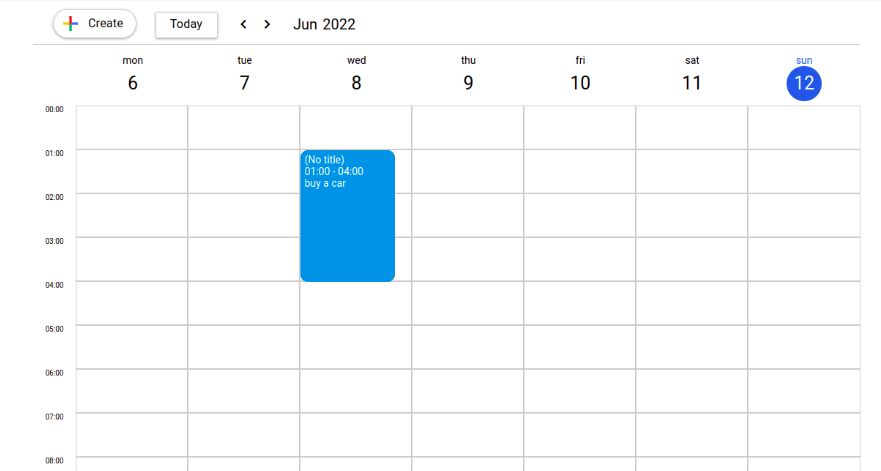

# Custom google calendar

### [Site link](https://hostlife22.github.io/custom-google-calendar/)

Layout supports mobile and desktop versions

<kbd>
  
 </kbd>

### The tech stack is:

- [JavaScript](https://ru.wikipedia.org/wiki/JavaScript)
- [HTML5](https://en.wikipedia.org/wiki/HTML5)
- [CSS3](https://en.wikipedia.org/wiki/Cascading_Style_Sheets)
- [Flexbox](https://en.wikipedia.org/wiki/CSS_Flexible_Box_Layout)
- [Sass (Scss)](https://sass-lang.com/)
- [BEM methodology](https://en.bem.info/methodology/)

### Author

- Sen Serafim
